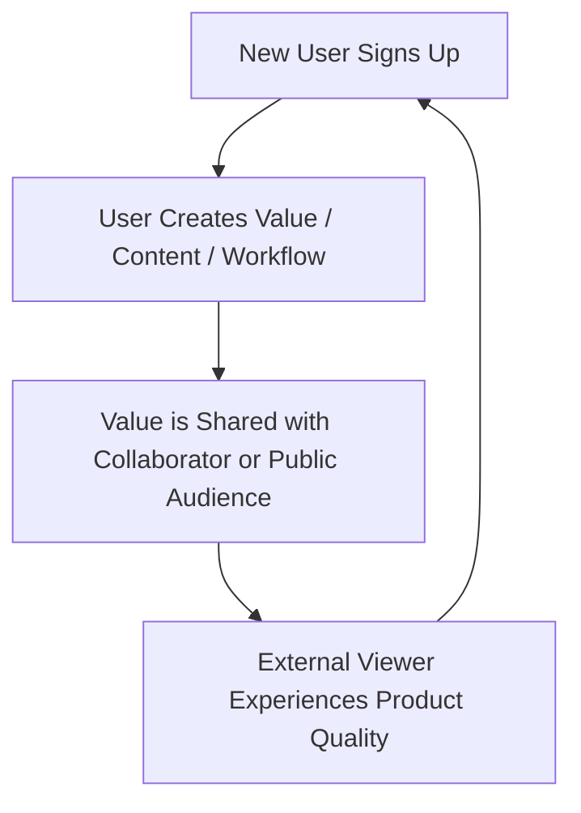

# Startup Growth & Business Model Strategist

A strategic advisory skill for startup founders, product leaders, and growth executives to validate unit economics, engineer high-velocity growth loops, formulate packaging/pricing strategies, and prepare compelling venture fundraising narratives.

---

## 1. SaaS Unit Economics & Financial Benchmarks

Essential SaaS financial formulas and healthy early-to-growth stage benchmarks:

| Metric | Formula | Target Benchmark |
| :--- | :--- | :--- |
| **LTV / CAC Ratio** | $\frac{\text{Gross Margin} \times \text{ARPU} / \text{Churn}}{\text{Total Sales \& Marketing Cost} / \text{New Customers}}$ | $> 3.0\times$ (Healthy), $> 5.0\times$ (Top Tier) |
| **CAC Payback Period** | $\frac{\text{CAC}}{\text{ARPU} \times \text{Gross Margin \%}}$ | $< 12 \text{ months}$ (SMB), $< 18 \text{ months}$ (Enterprise) |
| **Net Revenue Retention (NRR)** | $\frac{\text{Starting ARR} + \text{Expansion} - \text{Contraction} - \text{Churn}}{\text{Starting ARR}} \times 100$ | $> 110\%$ (SMB), $> 125\%$ (Enterprise) |
| **Magic Number (Sales Efficiency)** | $\frac{\text{Quarterly ARR Growth} \times 4}{\text{Previous Quarter S\&M Expense}}$ | $> 0.75$ (Efficient), $> 1.0$ (High Efficiency) |
| **Rule of 40** | $\text{YoY Revenue Growth Rate \%} + \text{Free Cash Flow Margin \%}$ | $> 40\%$ |

---

## 2. Market Sizing: Bottom-Up TAM / SAM / SOM Framework

Always prioritize **Bottom-Up** sizing over top-down analyst hand-waving:

1. **TAM (Total Addressable Market)**:
   $$\text{Total Potential Customers in the World} \times \text{Annual Contract Value (ACV)}$$
2. **SAM (Serviceable Addressable Market)**:
   $$\text{Customers fitting specific ICP (Geography/Vertical/Company Size)} \times \text{ACV}$$
3. **SOM (Serviceable Obtainable Market - 3-Year Target)**:
   $$\text{Realistic Market Share Capturable with existing sales capacity} \times \text{ACV}$$

---

## 3. Pricing & Packaging Strategy Framework

Design tiered pricing that aligns incentives with the customer's perceived value metric:

- **Identify the Core Value Metric**: Charge along the axis that scales with customer success (e.g., active users, API calls, GB processed, transactions, revenue share), rather than flat arbitrary feature gates.
- **Three-Tier Architecture**:
  1. **Starter / Hobby**: Frictionless entry point to drive adoption, validate self-serve onboarding, and seed organic word of mouth.
  2. **Pro / Growth (The Decoy / Hero Tier)**: The sweet spot with 70%+ of target features, targeted at growing teams.
  3. **Enterprise**: Security (SSO/SAML, SCIM), compliance (SOC2, HIPAA, audit logs), dedicated SLA, and custom billing contracts.
- **Psychological Pricing Principles**:
  - Annual billing discounts ($15\% - 20\%$ off) to front-load cash flow and reduce annualized churn.
  - Transparent feature comparison matrix with highlighted "Most Popular" anchor tier.

---

## 4. Growth Loops vs. Traditional Funnels

Replace linear funnels with self-reinforcing growth loops:

- **Product-Led Growth (PLG)**: The product itself serves as the primary driver of acquisition, retention, and expansion (e.g., Figma multiplayer invites, Notion shared docs, Slack team channels).
- **Viral Coefficient ($K$-Factor)**:
  $$K = i \times c$$
  Where $i$ is the number of invites sent per user and $c$ is the conversion rate of each invite. When $K > 1$, growth becomes exponentially self-sustaining.
