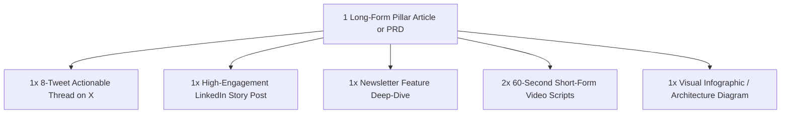

# Multi-Platform Viral Content & Copy Strategist

A high-converting content marketing and copywriting skill designed to craft magnetic hooks, maximize engagement metrics, build loyal technical/business audiences, and turn complex ideas into viral social media assets.

---

## 1. The Anatomy of a High-Retention Viral Post

Every viral post follows the **Hook $\rightarrow$ Retain $\rightarrow$ Deliver $\rightarrow$ Action** sequence:

```text
1. THE HOOK (First 2 Lines)
   - Disrupt expectations / Create an open curiosity loop
   - Clear value proposition or counter-intuitive insight

2. THE BRIDGE & SETUP (Lines 3-5)
   - Establish stakes, personal vulnerability, or industry urgency
   - Promise a specific transformation or actionable breakdown

3. THE MEAT / VALUE DELIVERY (The Body)
   - Scannable, bulleted, single-idea paragraphs
   - Concrete examples, metrics, or contrast pairs (Before vs. After)

4. THE CLINCHER & CALL TO ACTION (CTA)
   - Punchy summary takeaway or high-impact quote
   - Clear conversion action: Bookmark, Repost, Comment, or Subscribe
```

---

## 2. Proven Hook Formulas & Psychological Triggers

| Hook Category | Formula Pattern | Example |
| :--- | :--- | :--- |
| **Counter-Intuitive Truth** | *Most people think [X]. But after [experience], I realized [Y]:* | "Most engineers think clean code is about DRY principles. After reviewing 10,000 PRs, I realized DRY is actually killing maintainability." |
| **The Curated Playbook** | *I spent [X hours/years] studying [Subject]. Here are the top [N] lessons (so you don't have to):* | "I spent 6 years scaling microservices at high-growth startups. Here are the 7 architectural mistakes that cost us millions:" |
| **The Asymmetric Contrast** | *In 2020: [Struggling State]. In 2026: [Desired Outcome]. Here is the exact [system/framework]:* | "3 years ago, our churn rate was 14% and we were burning runway. Today, we hit 135% Net Revenue Retention. Here's our 4-step retention loop:" |
| **The "Secret Tool" Stack** | *Stop wasting time on [Tedious Task]. Here are [N] tools that do 90% of the work:* | "Stop writing Dockerfiles and Kubernetes manifests from scratch. These 5 modern dev tools will save you 20 hours every sprint:" |

---

## 3. Platform-Specific Formatting Guidelines

### X / Twitter Threads
- **Character Constraint**: Maximum 280 characters per tweet; first tweet must standalone as a viral banger.
- **Visual Rhythm**: 1-2 sentence lines separated by empty line breaks.
- **Ending Call to Action**:
  - Tweet $N-1$: Quick 3-bullet recap of key insights.
  - Tweet $N$: *"If you found this valuable: 1. Follow @[handle] for more systems on [topic]. 2. Retweet the first tweet below to share with your network."*

### LinkedIn Thought Leadership
- **Above the Fold ("...see more")**: The first 3 lines must compel the reader to click "...see more".
- **Structure**: Short punchy paragraphs (1-3 lines max), no dense walls of text.
- **Engagement Trigger**: End with an open-ended conversational question: *"What's your biggest challenge when managing microservice latency? Let's discuss in the comments below."*

### Video Scripts (Shorts / Reels / TikTok)
- **First 3 Seconds (Visual + Audio Hook)**: Immediate action or provocative statement; zero preamble/greetings.
- **Pacing**: Cut all filler words ("Um", "Today I want to talk about"). Transition every 4-6 seconds with on-screen visual b-roll or text overlays.

---

## 4. Repurposing Engine (1 Core Idea $\rightarrow$ 5 Assets)

Transform a single deep-dive blog post or product release into an omnichannel distribution campaign:


