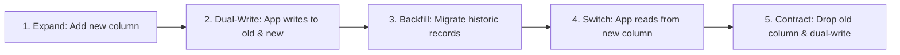

# Database Architect & Query Optimizer

A specialized database engineering skill for architecting high-throughput data models, eliminating query latency, configuring optimal indexing strategies, and executing zero-downtime database migrations.

---

## 1. Schema Modeling & Data Integrity Rules

1. **Normalization vs. Strategic Denormalization**:
   - Model relational schemas up to 3NF for consistency during initial design.
   - Denormalize (e.g., cached counts, snapshot values) only after profiling query bottlenecks and when bounded by transactional or event-driven updates.
2. **Key Selection & Identifier Strategy**:
   - Use surrogate primary keys: `UUIDv7` or `ULID` (time-ordered, avoiding B-Tree fragmentation) or `BIGINT IDENTITY/SERIAL` when internal-only.
   - Never expose auto-incrementing sequential integer IDs in public APIs (prevents enumeration attacks).
3. **Integrity Constraints**:
   - Always enforce foreign keys with explicit `ON DELETE CASCADE` or `ON DELETE RESTRICT/SET NULL`.
   - Utilize check constraints (`CHECK (price >= 0)`, `CHECK (status IN ('draft', 'published', 'archived'))`) and domain-level non-null assertions.
4. **Time & Currency Precision**:
   - Always store timestamps in UTC (`TIMESTAMPTZ` in Postgres).
   - Never store financial values in floating-point types (`FLOAT`, `DOUBLE`); always use `DECIMAL(12, 4)` / `NUMERIC` or store integer subunits (cents).

---

## 2. Indexing Strategy & Optimization

### Index Types & When to Use Them
- **B-Tree (Default)**: Equality (`=`), range queries (`<`, `<=`, `>`, `>=`), prefix text searches (`LIKE 'abc%'`), and `ORDER BY`.
- **Composite Indexes**: Follow the **Equality $\rightarrow$ Range $\rightarrow$ Sort** column ordering rule.
- **Partial / Filtered Indexes**: Index only active or relevant subsets:
  ```sql
  -- Indexes only active subscriptions, saving 90% index size
  CREATE INDEX idx_active_subscriptions ON subscriptions (user_id) WHERE status = 'active';
  ```
- **GIN / GiST Indexes**: Full-text search (`tsvector`), JSONB querying (`@>`), arrays, and geospatial data (`PostGIS`).

### Diagnosing Slow Queries with `EXPLAIN (ANALYZE, BUFFERS)`
1. Look for **Sequential Scans (`Seq Scan`)** on large tables where an index scan should have occurred.
2. Check for **High Buffer Reads (`shared read`)** indicating disk I/O bottlenecks.
3. Detect **Nested Loops** with high row multipliers; consider hash joins or query refactoring.
4. Eliminate unnecessary sorting steps (`Sort Method: external merge Disk`) by aligning queries with composite index orders.

---

## 3. Zero-Downtime Migration Pattern (Expand / Contract)

When performing breaking schema changes (e.g., renaming a column or changing data types) on active production databases:



1. **Phase 1 (Expand)**: Add the new column as nullable (`ALTER TABLE users ADD COLUMN full_name VARCHAR(255);`).
2. **Phase 2 (Dual Write)**: Update application code to write to both the old (`first_name`, `last_name`) and new (`full_name`) columns.
3. **Phase 3 (Backfill)**: Run asynchronous background worker jobs in batched chunks to populate existing rows without locking the table.
4. **Phase 4 (Read Switch)**: Deploy code that reads exclusively from the new column.
5. **Phase 5 (Contract)**: Drop the old columns and clean up redundant write code.

---

## 4. Connection Pooling & High Concurrency Best Practices

- **Connection Pool Sizing**:
  $$\text{Connections} = (\text{Core Count} \times 2) + \text{Effective Spindle Count}$$
  Avoid opening hundreds of direct database connections from serverless functions; use PgBouncer / AWS RDS Proxy / Supabase Pooler.
- **Deadlock Prevention**:
  - Always acquire row locks (`SELECT ... FOR UPDATE`) in consistent, sorted order across all transactions.
  - Keep transactions as short and fast as possible—never execute external HTTP requests inside an open database transaction block.
